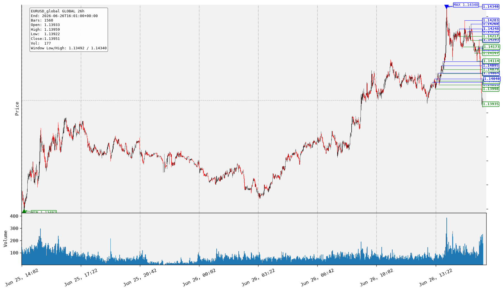
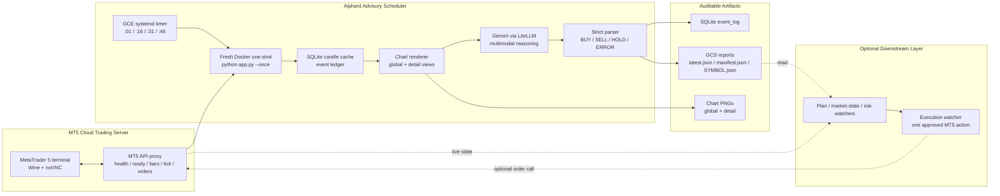
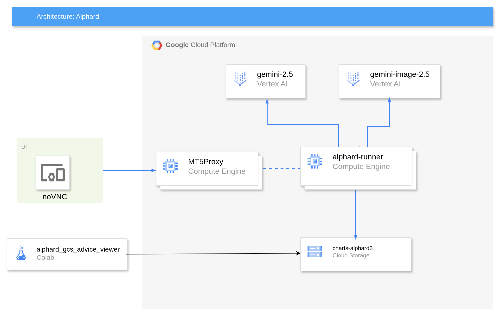
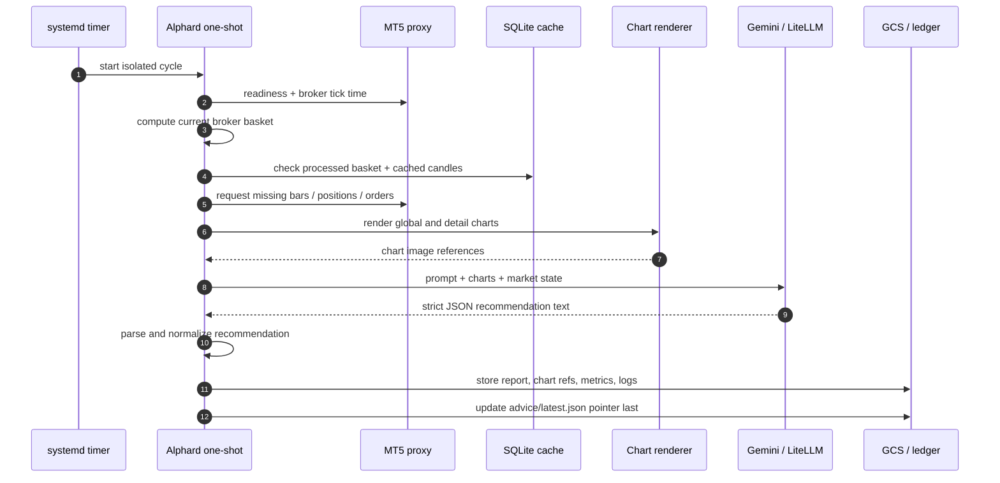
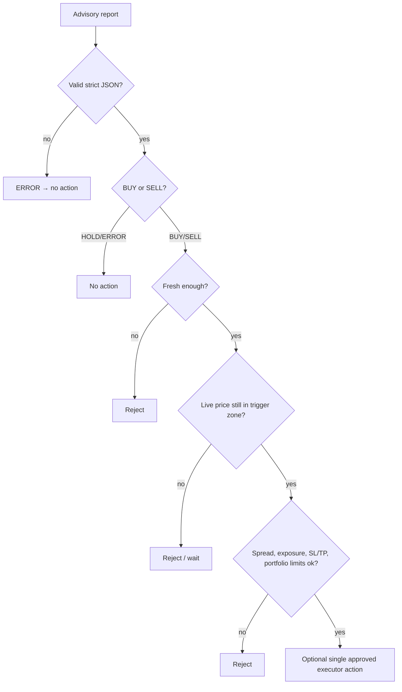

<div align="center">


<p>
  <strong>Multimodal market reasoning. Structured trade advice. Cloud-native auditability.</strong>
</p>

<p>
  <a href="#"></a>
  <a href="#"></a>
  <a href="#"></a>
  <a href="#"></a>
  <a href="#"></a>
</p>

<p>
  <a href="#quick-start">Quick Start</a> •
  <a href="#architecture">Architecture</a> •
  <a href="#advisory-output">Advisory Output</a> •
  <a href="#deployment">Deployment</a> •
  <a href="#safety-model">Safety Model</a>
</p>

</div>

---

> [!IMPORTANT]
> **Alphard is a research and advisory system, not financial advice.** The current live runtime has fully automatic and semi-automatic mode. Any execution must be handled by a separate, independently validated executor (see other repositories in Alphard project) or human review process. AI can make mistakes.

High-Quality video Demo can be downloaded from Cloud Storage: 
https://drive.google.com/file/d/1i92IcMuiTxwtEXlTg89Rz1SbRv3REKHL/view

## ✨ What is Alphard?

**Alphard** is a hybrid AI trading system for MetaTrader 5. Named after the brightest star in Hydra, it bridges two worlds that usually do not meet cleanly:

- the intuitive, visual price-action reading of a human trader;
- the repeatability, logging, and risk discipline of automated systems.

Instead of asking an LLM to guess from raw numbers alone, Alphard renders market structure into charts, sends those charts plus live MT5 context to a multimodal model, 
and stores a strict JSON advisory report for each market slot.

The result is an auditable pipeline that can answer:

> “What did the model see, what plan did it propose, which chart did it use, and why was a trade accepted, rejected, or ignored?”

## 🧠 Core idea

Alphard treats a trading decision as a **visual reasoning task with deterministic guardrails**.

```text
Market data is visual → Gemini reasons over charts → JSON advice is stored → watchers/executor decide
```

For every configured symbol, the advisory engine builds two complementary views:

| View | Default window | Purpose |
|---|---:|---|
| **Global context** | `1560` M1 candles, about 26 hours | Classify regime, range, channel, chop, major highs/lows |
| **Latest dynamics** | `180` M1 candles, about 3 hours | Inspect support/resistance tests, sweeps, retests, breakout quality |

The model is not given a single price in isolation. It sees wide context, local execution detail, positions, orders, tick data, symbol info, and deterministic visible levels.

Picture below shows the example of rendered chart:



## 🚀 What makes it different?

<table>
<tr>
<td width="33%">

### 👁️ Vision-first analysis

Candlestick structure is rendered as images and passed to a VLM, enabling direct chart interpretation instead of pure indicator stacking.

</td>
<td width="33%">

### 🧾 Strict JSON contracts

Recommendations are parsed into structured fields: `BUY`, `SELL`, `HOLD`, or `ERROR`, with confidence, levels, legs, stops, targets, invalidation, and risk notes.

</td>
<td width="33%">

### 🛡️ Execution boundary

The live advisory daemon reads MT5 state but does not trade. Execution is intentionally separated behind validators, watchers, or human review.

</td>
</tr>
<tr>
<td width="33%">

### ☁️ Cloud-native runtime

Designed for GCE, systemd timers, Docker one-shot runs, Google Cloud Storage, Vertex AI, and persistent SQLite state.

</td>
<td width="33%">

### 🔁 Replayable decisions

Each cycle writes charts, raw model output, parsed advice, metrics, logs, and GCS pointers so decisions can be reconstructed later.

</td>
<td width="33%">

### 🧪 Research-friendly

Legacy deterministic risk/execution modules, pullback-ratio strategy variants, and pytest coverage remain available for experiments and rollback.

</td>
</tr>
</table>

## Architecture



The architecture on high-level:




## Runtime workflow



## Advisory output

Alphard produces a structured report per symbol and market slot.

```json
{
  "schema_version": "alphard.advisory_recommendation.v1",
  "symbol": "GBPUSD",
  "timeframe": "M1",
  "uid": 202606241731,
  "strategy": "advisory_two_scale_strategy",
  "recommendation": {
    "status": "BUY",
    "confidence": 0.65,
    "market_classification": {
      "long_term_regime": "transition",
      "global_bias": "two_way_range",
      "current_location": "middle"
    },
    "latest_dynamics": {
      "state": "impulse_extension",
      "preferred_direction": "buy",
      "entry_quality": "acceptable"
    },
    "action_plan": {
      "recommendation": "BUY",
      "total_allocation_pct": 80,
      "risk_level": "medium",
      "primary_stop_loss": 1.3154,
      "primary_take_profit": 1.3188,
      "order_plan": [
        {
          "leg_id": "L1",
          "side": "buy",
          "order_kind": "market_watch",
          "allocation_pct": 20,
          "entry_zone": { "from": 1.3172, "to": 1.3175 },
          "invalid_if": "Price loses the trigger zone before entry."
        }
      ]
    },
    "risk_notes": []
  }
}
```

### Recommendation states

| State | Meaning | Safe downstream behavior |
|---|---|---|
| `BUY` | Directional long advice exists | Validate freshness, spread, trigger zone, exposure, SL/TP, and portfolio risk before any execution |
| `SELL` | Directional short advice exists | Same validation requirements as `BUY` |
| `HOLD` | No trade is justified | Do nothing |
| `ERROR` | Parsing/model/provider failure or invalid output | Do nothing; inspect diagnostics |

## GCS report contract

When `IMAGE_PROVIDER=gcs`, Alphard writes a stable pointer plus immutable slot artifacts:

```text
gs://<bucket>/
  charts/
    <SYMBOL>/
      <SYMBOL>_global_<uid>_1560bars_global_16x9.png
      <SYMBOL>_detail_<uid>_180bars_detail_1x1.png

  advice/
    latest.json
    <uid>/
      manifest.json
      <SYMBOL>.json
```

Consumers should always start from the static pointer:

```text
1. Read gs://<bucket>/advice/latest.json
2. Read latest.manifest.gcs_uri
3. Read manifest.results[]
4. For each PROCESSED symbol, read result.artifact.advice.gcs_uri
5. Use result.artifact.charts.global/detail for visual audit
```

`latest.json` is written last. This makes it the stable entry point for dashboards, downstream executors, or notebooks.

## Project layout

```text
.
├── app.py                              # async advisory daemon entry point
├── requirements.txt
├── core/
│   ├── candle_cache.py                 # SQLite OHLCV cache + incremental sync
│   ├── execution.py                    # legacy/dry-run execution module
│   ├── ledger.py                       # candles, events, basket processing ledger
│   ├── models.py                       # typed domain models
│   ├── mt5_api.py                      # async MT5 proxy client
│   ├── pullback_ratio.py               # deterministic pullback-limit math
│   ├── risk.py                         # legacy deterministic risk validation
│   ├── strategy.py                     # chart generation, VLM call, parsing
│   └── timeframes.py                   # broker basket/time alignment helpers
├── middleware/
│   └── llm_middleware.py               # LiteLLM/Gemini adapter and metrics
├── utilities/
│   ├── ImageStorage.py                 # local/GCS image and JSON storage
│   ├── imagegenv2.py                   # chart rendering utilities
│   ├── prompt_manager.py               # Jinja prompt loading
│   └── settings.py                     # env-driven app config
├── templates/
│   ├── advisory_two_scale_strategy.j2  # production advisory prompt
│   ├── levels_strategy.j2              # legacy level strategy
│   └── *_pullback_ratio*.j2            # pullback-ratio strategy variants
├── scripts/
│   ├── deploy_infra.sh
│   ├── show_metrics.py
│   └── gcp/
│       ├── deploy_alphard_vm.sh
│       └── allow_mt5proxy_firewall.sh
└── tests/
    ├── test_advisory_refactor.py
    ├── test_basket_processed.py
    ├── test_candle_cache.py
    ├── test_parser_risk.py
    ├── test_pullback_ratio_planner.py
    └── test_time_alignment.py
```

## Quick start

### 1. Install

Clone the repository:

```bash
git clone https://github.com/akaliutau/alphard3.git
cd alphard3
```

Create and activate a Conda environment:

```bash
conda create -n alphard3 python=3.12 -y
conda activate alphard3
```

Install dependencies:

```bash
pip install -r requirements.indexframe.txt
```

### 2. Create a local environment file

```bash
cp .env.example .env.local
```

A minimal local advisory configuration looks like this:

```env
APP_NAME=alphard
APP_ENV=local
DRY_RUN=true
ADVISORY_ONLY=true
LOG_LEVEL=INFO

RUN_INTERVAL_MINUTES=15
CANDLE_CLOSE_DELAY_SECONDS=30

MT5_BASE_URL=http://127.0.0.1:8000
MT5_API_KEY=dev-api-key # auto-generated and printed in console when you deploy mt5proxy instance
MT5_TIMEOUT_SECONDS=30

SYMBOLS=EURUSD,GBPUSD
MT5_TIMEFRAME=M1
CANDLE_WARMUP_BARS=1800
GLOBAL_ANALYSIS_BARS=1560
DETAILED_ANALYSIS_BARS=180
GLOBAL_CHART_ASPECT=16:9
DETAILED_CHART_ASPECT=1:1

MODEL_NAME=gemini-2.5-pro
MODEL_ID=vertex_ai/gemini-2.5-pro
VERTEX_LOCATION=global
GOOGLE_CLOUD_PROJECT=your-gcp-project
GOOGLE_APPLICATION_CREDENTIALS=./service-account.json
LITELLM_MAX_TOKENS=8192

IMAGE_PROVIDER=local
GCS_BUCKET_NAME=
GCS_PUBLIC_READ=false

ADVISORY_STRATEGY_NAME=advisory_two_scale_strategy
SQLITE_PATH=data/alphard.sqlite3
DATA_DIR=data
IMAGE_CACHE_DIR=img_cache
```

> [!WARNING]
> Never commit real `.env`, API keys, service-account JSON, account IDs, or broker credentials. Keep cloud secrets outside the repository.

### 3. Smoke-test the MT5 proxy

```bash
ENV_FILE=.env.local python -m tests.smoke_mt5_api --symbol EURUSD
```

### 4. Run one advisory cycle

```bash
ENV_FILE=.env.local python app.py --once
```

### 5. Run continuously for local development

```bash
ENV_FILE=.env.local python app.py
```

The continuous local loop sleeps until the configured interval boundary. In production, prefer the GCE systemd timer one-shot pattern described below.

## Configuration reference

| Variable | Typical value | Purpose |
|---|---|---|
| `ADVISORY_ONLY` | `true` | Keeps the live app in recommendation-only mode |
| `RUN_INTERVAL_MINUTES` | `5`, `15`, or `30` | Cycle cadence |
| `SYMBOLS` | `EURUSD,GBPUSD` | Comma-separated MT5 symbols |
| `MT5_TIMEFRAME` | `M1` | Candle timeframe used by advisory strategy |
| `GLOBAL_ANALYSIS_BARS` | `1560` | Wide chart window, about 26 hours on M1 |
| `DETAILED_ANALYSIS_BARS` | `180` | Local chart window, about 3 hours on M1 |
| `MODEL_ID` | `vertex_ai/gemini-2.5-pro` | LiteLLM model identifier |
| `LITELLM_MAX_TOKENS` | `8192` | Prevents long JSON advice from being truncated |
| `IMAGE_PROVIDER` | `local` or `gcs` | Whether charts/reports remain local or upload to GCS |
| `GCS_BUCKET_NAME` | `charts-alphard` | Bucket for chart PNGs and advisory JSON |
| `SQLITE_PATH` | `data/alphard.sqlite3` | Candle and event ledger database |

## Deployment

Alphard is designed to run as an **ops-only Docker one-shot** on a persistent Google Compute Engine VM.

```text
GCE VM
  systemd timer
    → alphard.service
      → /usr/local/bin/alphard-run-once.sh
        → flock /run/alphard.lock
          → docker run --rm IMAGE --once
            → python app.py --once
```

Why one-shot instead of a forever-running container?

- each cycle starts from a clean Python process;
- leaked HTTP clients, matplotlib state, LiteLLM state, or MT5 proxy state cannot accumulate forever;
- `flock` prevents overlapping cycles;
- logs are easy to inspect through `journalctl`;
- SQLite, GCS references, and image cache persist under the VM data directory.

### First GCP deployment

```bash
gcloud auth login
gcloud config set project YOUR_PROJECT_ID

cp .env.cloud.example .env.cloud
# edit MT5_BASE_URL, MT5_API_KEY, PROJECT_ID, bucket, symbols, model config

export ENV_CLOUD_FILE=$PWD/.env.cloud
export OVERWRITE_ENV=true
source scripts/set_env.sh
scripts/deploy_infra.sh
scripts/gcp/deploy_alphard_vm.sh
```

Recommended VM size:

| VM | Use case |
|---|---|
| `e2-small` | Default starting point for pandas + matplotlib + LiteLLM + Google libraries |
| `e2-medium` | More symbols, longer cycles, or heavier chart/model workloads |
| `e2-micro` | Cheap experiments only; memory can be tight |

### MT5 proxy firewall

If the MT5 proxy runs on another VM, keep both VMs in the same VPC and restrict proxy access by network tags:

```bash
export PROJECT_ID=YOUR_PROJECT_ID
export NETWORK=default
export MT5_PROXY_TAG=mt5proxy
export MT5_PROXY_PORT=8000
scripts/gcp/allow_mt5proxy_firewall.sh
```

Then configure Alphard with the internal proxy address:

```env
MT5_BASE_URL=http://MT5_PROXY_INTERNAL_IP:8000
```

## Operations

Check the timer:

```bash
gcloud compute ssh alphard-runner --zone europe-west2-b \
  --command 'systemctl list-timers alphard.timer --no-pager'
```

View recent run logs:

```bash
gcloud compute ssh alphard-runner --zone europe-west2-b \
  --command 'sudo journalctl -u alphard.service -n 200 --no-pager'
```

Run one cycle manually:

```bash
gcloud compute ssh alphard-runner --zone europe-west2-b \
  --command 'sudo systemctl start alphard.service && sudo journalctl -u alphard.service -n 120 --no-pager'
```

Inspect recent metrics:

```bash
ENV_FILE=.env.local python scripts/show_metrics.py --limit 20
```

Disable the runner:

```bash
gcloud compute ssh alphard-runner --zone europe-west2-b \
  --command 'sudo systemctl disable --now alphard.timer'
```

## Safety model

Alphard is intentionally built with hard boundaries.



Built-in and architectural guardrails:

- **Advisory-only live cycle** — the current `app.py` path does not call MT5 trading endpoints.
- **Idempotent baskets** — processed symbol/timeframe/UID/strategy combinations are recorded to prevent duplicate work.
- **Strict recommendation states** — `HOLD` and `ERROR` must never become orders.
- **Raw audit trail** — raw model text, parsed output, token metrics, latency, chart refs, and error diagnostics are stored.
- **Pointer-last GCS writes** — consumers start from `advice/latest.json`, which is updated after reports and manifest are written.
- **Downstream validation required** — execution should validate freshness, price drift, spread, stop/freeze levels, exposure, and portfolio risk again.

## Legacy and experimental strategy modules

The repository also contains earlier/experimental trading components:

### Pullback-ratio strategy

A deterministic pending-limit planner computes entries from the live quote toward a structural stop:

```text
BUY_LIMIT  = bid - (bid - stop_loss) * PULLBACK_RATIO
SELL_LIMIT = ask + (stop_loss - ask) * PULLBACK_RATIO
```

This avoids letting the prompt invent a precise `entry_price`. The VLM identifies direction, structural SL/TP, and evidence; deterministic code computes the limit price and validates geometry.

### Deterministic execution path

`core/risk.py` and `core/execution.py` remain available for tests, offline experiments, and rollback work. They are not part of the advisory-only live path unless you deliberately wire them in.

## Testing

Run the full test suite:

```bash
pytest -q
```

Useful focused tests:

```bash
pytest -q tests/test_advisory_refactor.py
pytest -q tests/test_time_alignment.py
pytest -q tests/test_candle_cache.py
pytest -q tests/test_pullback_ratio_planner.py
```

Smoke-test live MT5 connectivity:

```bash
ENV_FILE=.env.local python -m tests.smoke_mt5_api --symbol EURUSD
```

## Troubleshooting

### Model output ends mid-JSON

If reports show `recommendation.status = ERROR` and LLM metrics show a length-based finish reason, increase token budget:

```env
LITELLM_MAX_TOKENS=8192
ADVISORY_ERROR_PREVIEW_CHARS=4000
```

### GCS URLs are not publicly readable

This is expected when `GCS_PUBLIC_READ=false`. Downstream services should use authenticated GCS access with `gs://` URIs or signed/proxied URLs.

### A cycle skips a symbol

Common reasons:

- the basket was already processed;
- the target broker candle is not available in cache yet;
- the MT5 proxy is not ready;
- the model/provider call failed;
- strict JSON parsing failed.

Check the SQLite ledger and service logs for the exact event.

### Cycles overlap or run too long

The deployment uses `flock` to prevent overlap. If cycles regularly approach the service timeout, reduce the number of symbols, increase VM size, or use a longer interval.

## Roadmap ideas

- Dashboard for latest GCS reports and chart review.
- Watcher ensemble service for schema, market-state, risk, and execution validation.
- Walk-forward evaluation over historical M1 candles.
- Probabilistic barrier-outcome model: estimate `TP-first`, `SL-first`, and `timeout` probabilities directly.
- Portfolio-level exposure optimizer across correlated FX symbols.

## In short

Alphard is easiest to understand as a three-layer system:

1. **MT5 server** — the cloud terminal and API proxy expose market data, positions, orders, and optional order operations.
2. **Advisory scheduler** — a fresh one-shot process snapshots the market, renders charts, asks Gemini for multimodal analysis, and writes structured advice.
3. **Watcher/executor layer** — downstream validators decide whether an advisory plan is still valid under live market, risk, and portfolio conditions.

That separation keeps the system explainable. Every stage leaves artifacts behind, so you can replay what happened and inspect exactly why a trade was proposed, ignored, rejected, or escalated.

## License

Source Available / Non-Commercial Use Only

This project is licensed under the [PolyForm Noncommercial License 1.0.0](https://polyformproject.org/licenses/noncommercial/1.0.0/)

✅ Allowed: You may read, run, modify, and use this code for personal research, education, or hobbyist projects.

❌ Forbidden: You may not use this code for any commercial purpose. This includes selling the software, using it to manage third-party funds for a fee, or using it as part of a paid/for-profit projects.


---

<div align="center">

<strong>Alphard</strong> — visual market reasoning with auditable, structured trade advice.


</div>
